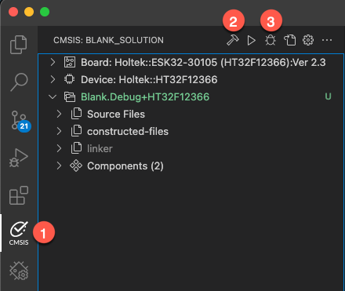

# ESK32-30105 Example

This is an example project for the
[Holtek ESK32-30105](https://www.holtek.com/page/tool-detail/dev_kit/sk/sk_32/ESK32-30105) based on the blank template in
Keil Studio. It is set up to use the open-source Arm CMSIS Debugger.

## How to use

Here's how to get started quickly:

1. Open the **CMSIS View**.
2. **Build** the project.
3. Start **debugging**.
